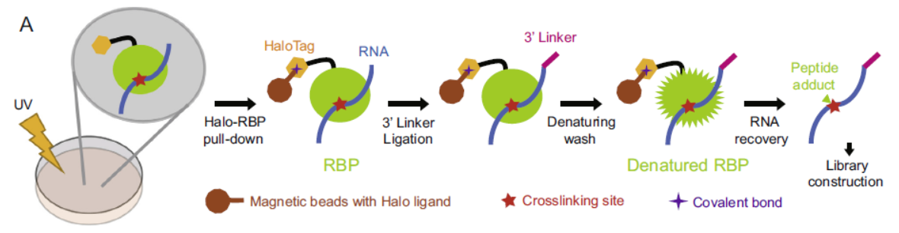
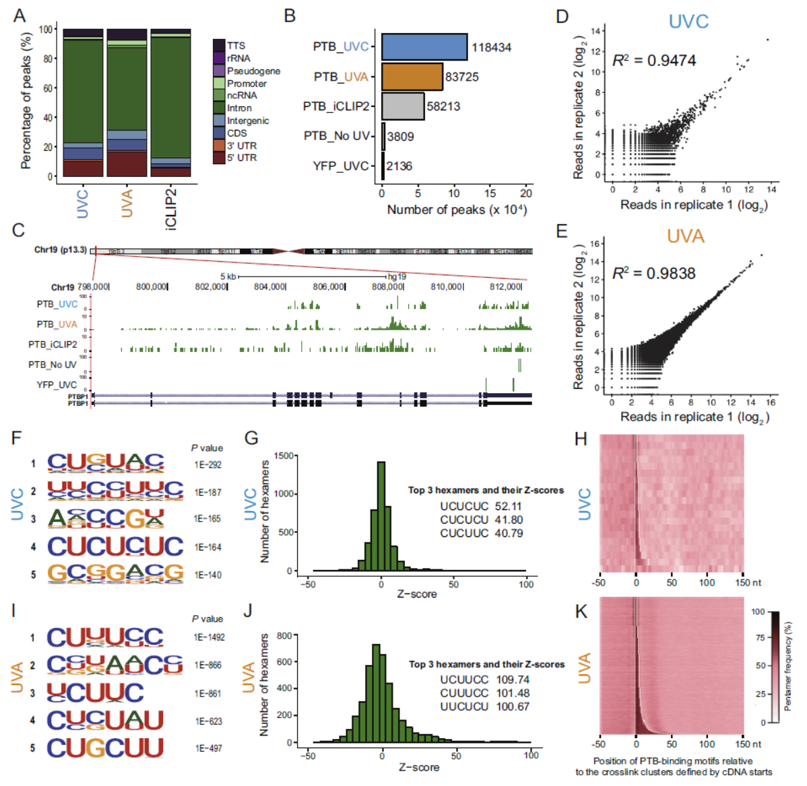
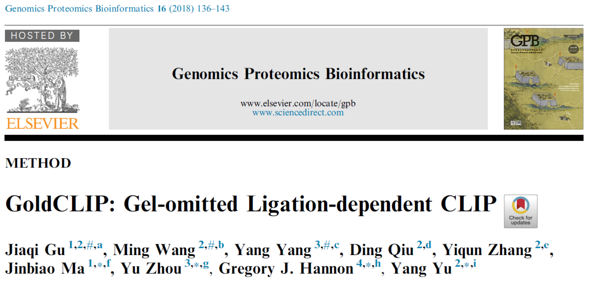

[文稿转自 BioArt]

核酸与蛋白质的互作在生物体内发挥着不可或缺的作用。传统上研究核酸和蛋白质互作主要有两种方法。其一是**RIP技术**（RNA Immunoprecipitation），其二是**CLIP技术**（UV crosslinking and immunoprecipitation）。

RIP技术通过纯化RNA和RNA结合蛋白的复合物来研究RNA结合蛋白所结合的RNA。如表1所示，其优点是步骤少，操作简单。其主要缺点在于存在细胞裂解后核酸飘逸的现象，因此在RIP的数据中假阳性的结果比较多，而且也无法得知RNA和蛋白的具体结合位点。为了克服RIP的缺点，2003年，Robert B Darnell实验室最先发表了通过紫外交联的方法来研究RNA和蛋白质互作的相关文章（Science，2003），即CLIP技术（**基本流程如图1所示**）。其优点是得到的数据特异性高，同时能够得知蛋白和核酸交联的位置。其缺点也很明显就是步骤多，操作的要求极高。

<figure class="image">
  
  <figcaption>图1 GoldCLIP的简要流程图</figcaption>
</figure>

为了提高CLIP技术的效率，中科院生物物理研究所俞洋组改进了传统的CLIP技术，提出了**GoldCLIP技术**(Gel-omitted and ligation-dependent CLIP)。通过利用Halo-tag的特性简化在体外纯化蛋白质和核酸复合物的步骤，从而省略了体外胶膜纯化蛋白RNA复合物的步骤。在体外，Halo-tag是经基因工程改造的脱卤素酶，其活性中心只能与含有卤素的配体以共价键的形式相互结合，而且该共价键不能打开。因此，当将靶蛋白和Halo标签融合后，含有Halo-tag的蛋白/RNA复合物就可以与含有卤素配体的磁珠共价偶联。这样就能在体外进行严格地洗涤，从而简化了胶膜纯化的步骤。Halo标签的分子量为33kDa，可以结合在靶蛋白的N端或者C端。该融合蛋白可以在原核或真核表达系统中表达。

GoldCLIP的流程如**图2**所示。首先通过磁珠分离蛋白RNA复合物，然后在RNA的3’端加上接头，接着通过蛋白变性剂，如Urea，Guanidine，SDS等，对蛋白RNA复合物进行洗涤，最后得到高纯度的蛋白/RNA复合物。然后降解蛋白，回收RNA。将RNA转录成cDNA后进行建库、测序，即可得到该蛋白在体内的RNA结合位点。

研究人员用GoldCLIP技术研究了PTB蛋白（polypyrimidine-tract binding protein）并和前人的加过进行了比较。PTB蛋白是一个经典的RNA结合蛋白，前人研究表明PTB通过结合CU-rich的motif来调控对体内RNA的加工。在文章中，他们使用了两种紫外交联方式对PTB蛋白进行了交联，分别是UVC（波长254nm）和UVA（波长365nm）。结果如**图3**所示，GoldCLIP技术可以较好的重复以前的文献发表的实验结果。**因为使用了Halo-tag，在磁珠共价结合Halo蛋白后，可以直接在完全变性的条件下对复合物进行纯化，从而省略了同位素标记以及跑胶转膜等繁琐步骤**。因此，GoldCLIP操作简单，能有效地等到高度可重复的数据，是值得大家关注和推广的技术。

<figure class="image">
  
  <figcaption>图3 GoldCLIP识别的PTB结合位点。</figcaption>
</figure>

GoldCLIP技术近日以“GoldCLIP: Gel-omitted Ligation-dependent CLIP”为题发表在**Genomics, Proteomics & Bioinformatics**杂志上，文章通讯作者为中科院生物物理研究所俞洋、复旦大学生命科学学院麻锦彪、剑桥大学Gregory J. Hannon以及武汉大学周宇。

<figure class="image">
  
  <figcaption>Published on GPB</figcaption>
</figure>

