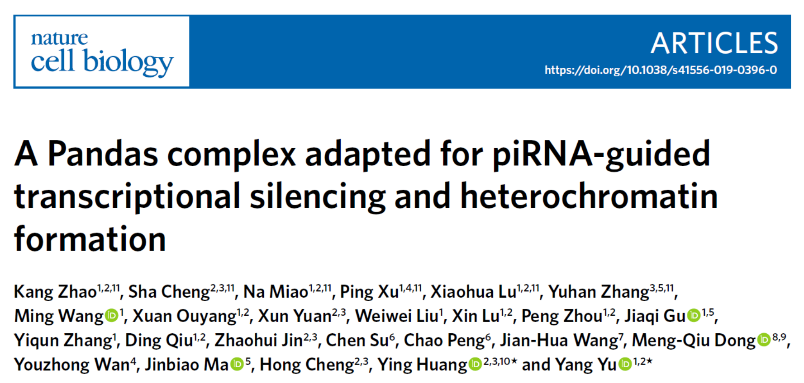
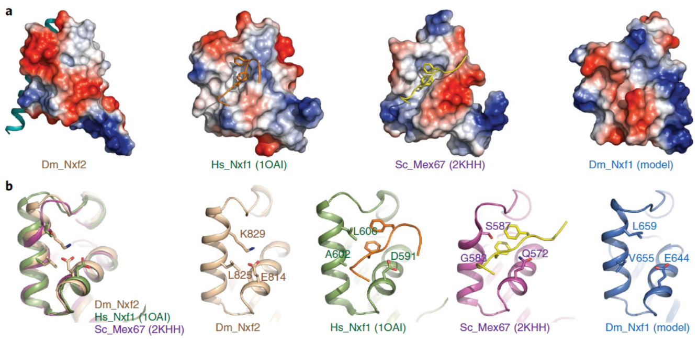
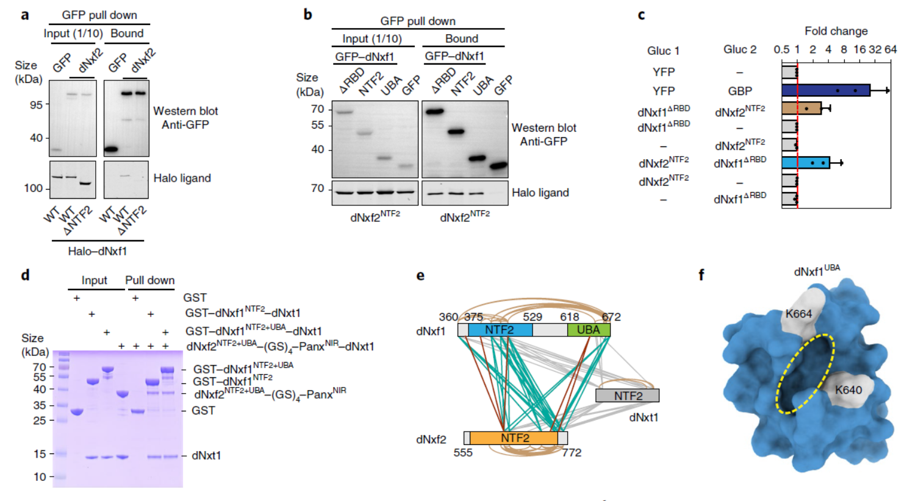
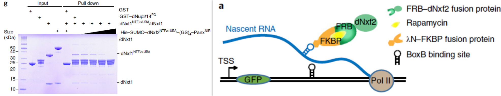
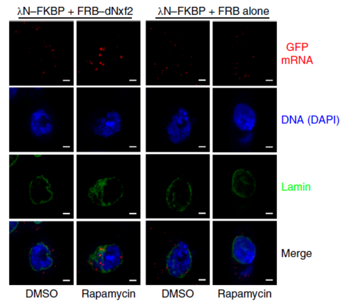

[文稿转自 BioArt]

转座子（transposon）由冷泉港实验室Barbara McClintock（1983年获得诺贝尔奖）首先在玉米中发现【1】。转座子又被称为“跳跃基因”，类似于内源性病毒，能够在宿主基因组中“复制和粘贴”自己的DNA，以达到其自我“繁殖”的目的。转座子的“跳跃”可能会产生基因组不稳定性，并导致动物不孕不育。有多种调控机制沉默转座元件并维持基因组完整性，例如组蛋白修饰和DNA的甲基化等。为了抵抗转座子，动物的生殖系统进化出了一类小非编码RNApiRNA（Piwi-Interacting RNA）来严格调控转座子的表达【2】。概念上，真核生物的piRNA通路在功能上类似于原核生物的CRISPR系统。

piRNA簇（piRNA cluster）表达的piRNA长度大约在24到31nt之间，通过与PIWI家族蛋白（Argonaute家族蛋白的一个亚家族）形成piRISC复合物（piRNA induced silencing complex）而起作用。piRISC复合物能在转录（TGS，Transcriptional gene silencing）和转录后水平的沉默转座子（PTGS，Post-transcriptional gene silencing）【3】。PTGS主要通过“乒乓循环”（ping-pong cycle）在切割piRNA靶标的同时产生更多的新生piRNA，从而形成类似“先天免疫系统”的正反馈，在细胞质层面降解转座子RNA。TGS是在转录水平沉默目标转座子最终结果是诱导转座子插入位点形成组成型异染色质。转座子的沉默通常跟组蛋白修饰（H3K9me3）有很强的相关性【3】。目前认为，Piwi/piRNA复合物通过转座子新生RNA招募Panoramix（Panx）【4-5】，并最终导致转座子区域异染色质的形成，该过程需要H3K9me3甲基化转移酶SetDB1/Eggless和H3K4me2去甲基化酶LSD1。

2019年9月30日，中科院生物物理所[俞洋团队](http://www.ibp.cas.cn/ktzz/ktzz_xy/201603/t20160303_4542073.html) 和上海生化细胞所[黄旲](http://www.sibcb.ac.cn/PI.asp?id=133) （Ying）团队（现上海交大医学院）在**Nature Cell Biology**杂志上以长文形式在线发表了题为**A Pandas complex adapted for piRNA-guided transcriptional silencing and heterochromatin formation**的研究，该工作在俞洋/Hannon之前的工作基础上【4】进一步深入阐明了piRNA介导的转座子异染色质形成的分子机制。该研究发现，生殖细胞特异表达的核转运因子（NXF）家族蛋白dNxf2能与dNxt1（P15）以及Panx形成三元复合物，并通过竞争性结合阻止dNxf1（又叫TAP，是介导mRNA出核的经典接头蛋白）与核孔互作，从而导致了转座子新生RNA在核内的滞留。该文章首次证明PANDAS（Panoramix-dNxf2 dependent TAP/p15 Silencing）复合物的存在，并提出了RNA介导异染色质形成的新理论，既阻断新生RNA出核在调控异染色质过程中起核心作用，并为将来研究其它RNA介导的表观遗传调控提供指导意义（图1）。该文章的发表，也给今年四月份在BioRxiv同时上线的关于Drosophila Nxf2的四篇预印本文章之间的良性竞争画上句号【6-9】。

本研究中，俞洋课题组充分利用果蝇这一模式生物的优势，综合分析针对piRNA通路的全基因组RNAi筛选结果和flybase中全蛋白组免疫沉淀质谱的大数据，再结合已建立的RNA拴住报告基因筛选体系，首先快速锁定了dNxf2在piRNA/Panx介导的转座子沉默过程中的核心作用。与此同时，俞洋课题组通过和专注于piRNA通路的结构生物学家黄旲课题组的精诚合作，解析了Panx-dNxf2互作结构域的晶体结构。作者通过晶体结构的分析发现，dNxf2的UBA结构域一方面进化出跟Panx直接互作的疏水界面，另一方面也丢失了一般NXF家族蛋白固有的结合核孔复合物的能力（从而解释了为什么dNxf2不能像dNxf1一样介导mRNA出核），为在分子层面进一步理解dNxf2的作用机制奠定了坚实基础（图2）。

<!--  -->

<figure class="image">
  
  <figcaption>图2. 比较Nxf2型和Nxf1型的UBA结构域。左边，Panx结合面；右边，NPC结合面</figcaption>
</figure>

由于dNxf2能跟Panx能形成相互依赖的复合物，dNxf2有着跟Panx类似的诱导基因沉默的功能，即可以通过新生RNA介导基因沉默和异染色质形成。和其它经典piRNA通路蛋白一样，dNxf2的缺失会导致动物体完全不孕不育。有趣的是，小鼠的Nxf2敲除之后在特定条件下也有不育的表型【10】。一系列分子生物学实验和遗传学（co-IP/IP mass spec，GST pull-down，Y2H，GoldCLIP等）也证实dNxf2确实是Panx介导转座子沉默过程中的核心蛋白。但是，作者在研究过程中发现，在dNxf2缺失并一同过表达Panx的条件下，转座子的H3K9me3基本保持不变。具有讽刺意味的是，在此条件下果蝇却是完全不育的，因为转座子仍然是大规模上调的。该结果也直接暗示两点：**1. H3K9me3只是异染色质形成的必要非充分条件；2. dNxf2调控转座子沉默的分子机制不仅仅是招募Panx以及下游的甲基化转移酶SetDB1那么简单。**

通过大量的文献阅读以及跟研究RNA出核方面的专家程红教授（见BioArt报道：程红组近期4篇研究论文阐述新生RNA出核和降解的命运决定与调控）讨论，作者意识到如果仅是dNxf2自身失去核孔复合物结合能力并不足以解释为什么转座子RNA不能出核。dNxf2还需要阻止经典的mRNA出核通路，即通常依赖于mRNA 的5’ Cap结构招募的dNxf1（TAP）复合物。而前人研究也暗示NXF家族蛋白有能力形成异元二聚体，因此，作者大胆假设dNxf2可能通过抑制dNxf1复合物来阻止转座子mRNA的出核。令人兴奋的是，各方面数据包括co-IP，GST pull down，Split luciferase和交联质谱等都充分支持dNxf2:dNxf1能直接互作（图3）。

<!--  -->

<figure class="image">
  
  <figcaption>图3. 四方面证据证实dNxf2NTF2跟dNxf1NTF2+UBA直接互作</figcaption>
</figure>

最后，作者通过体外竞争实验和体内瞬时RNA拴住实验为dNxf2抑制dNxf1介导的RNA出核功能这一假说提供了充分的证据（图4）。非常有意思的是，程红课题组最近在哺乳动物的细胞的研究表明Nxf1是RNA聚合酶Pol II有效延伸（transcription elongation）所必须的【11-12】。因此，dNxf2抑制Nxf1的后果很可能不仅仅是阻止转座子RNA的出核，很有能PANDAS会导致Pol II转录延伸的停止。虽然这个理论亟待证实，但是它可以被完美的统一在现有的piRNA介导转座子转录沉默的模型中。

<!--  -->

<figure class="image">
  
  <figcaption>图4. dNxf2通过与Nxf1竞争核孔复合物而阻止新生RNA出核</figcaption>
</figure>

本项研究的共同第一作者包括（排名不分先后）中科院生物物理所研究生赵康、苗娜、卢晓华，上海生化细胞所研究生程莎，吉林大学研究生徐平和复旦大学博士后张玉涵。本研究的合作者包括中科院生化细胞所程红研究员、复旦大学麻锦彪教授、北京生命研究所董梦秋研究员和吉林大学万由忠教授。中科院生物物理所[俞洋研究员](http://www.ibp.cas.cn/ktzz/ktzz_xy/201603/t20160303_4542073.html) 和上海生化细胞所[黄旲研究员](http://www.sibcb.ac.cn/PI.asp?id=133) (现上海交通大学医学院) 为共同通讯作者。

## 专家点评

**刘默芳** （中科院生化细胞所）

piRNA是2006年在动物生殖细胞中鉴定到的一类小分子非编码RNA。piRNA及其结合蛋白Piwi通过沉默转座元件维持生殖细胞基因组DNA的稳定性和完整性，并同时介导生殖细胞中编码基因的表达调控，在生殖细胞发育级配子形成过程中发挥了不可或缺的重要作用。piRNA的生成、代谢及作用方式显著不同于在各类组织细胞中都普遍表达的miRNA和siRNA。目前，对piRNA在表观遗传及转录后水平调控基因表达的机制已有所了解，但对其在转录水平沉默基因表达的研究还很少。Panx是该过程中被发现的第一个重要蛋白，衔接了Piwi及下游的表观调控因子（Science 2015），然而对于Panx具体怎样进行调控机制尚不清楚。

日前，Nature Cell Biology在线发表了中科院生物物理所俞洋研究组和中科院上海生化细胞所黄旲研究组关于Panx介导转录沉默的重要成果“A Pandas complex adapted for piRNA-guided transcriptional silencing and heterochromatin formation”。本文是对上述工作的一个延续，**不仅找到了Panx的作用蛋白dNxf2，阐明了Panx特异性地与dNxf2相互作用以及dNxf2不能与核孔复合体结合的分子机制，并证明了dNxf2通过与dNxf1的直接相互作用，通过竞争转座子RNA的出核来促进piRNA介导的转录沉默。**

值得注意的是，同一时期有4篇类似研究工作发表，另外3篇分别来自Brennecke实验室（Nat Struct Mol Biol 2019）、Hannon实验室（eLife 2019）和Siomi实验室（EMBO J 2019）。4个研究团队的工作都独立地发现了piRNA引导的转座子沉默依赖于dNxf2和Panx之间的相互作用。然而，俞洋/黄旲研究组的合作研究进一步揭示了**dNxf2通过阻止与核孔蛋白的结合而直接与dNxf1结合，从而解释了dNxf2如何阻止dNxf1介导的RNA出核**。由于dNxf2优先与piRNA靶向的转录产物结合，dNxf2的沉默功能很可能是竞争了dNxf1结合转座子转录产物RNA的出核，**从而将转座子转录物捕获在核周围**，以便于建立/维持异染色质。此项研究对理解RNA代谢如何调节表观遗传基因沉默和异染色质形成具有广泛意义。

**张钊** （杜克大学）

综合历史因素（小RNA的发展史）和piRNA系统本身的精密复杂性，piRNA领域 （尤其是在研究piRNA生成和作用机制方面）长期以来一直保持着小而封闭的特性。因其小，piRNA相关研究一直保持着很高的科研水准，极大的促进了领域的发展。因其封闭，很难吸收新鲜血液，其发展常因缺乏包容性而陷入瓶颈期，极大的限制了领域的发展。作为新生力量，俞洋课题组和黄旲课题组的此次的强强联合为我们奉献了一篇高水准的科研大餐。和其他三篇文章相比较，其全方位多角度的透析使其在完整性上独领风骚。作为“当下非大牛”实验室，他们能在此轮激烈的竞争下完美的绽放，实属不易。同时期待这股新鲜血液给我们带来更多惊喜。

https://www.nature.com/articles/s41556-019-0396-0